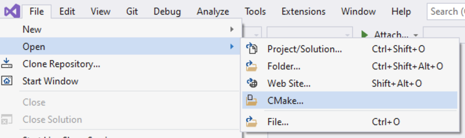

# Using cmake from Visual Studio

As with [CLI](cli.md) approach, we keep here also project and build
directories separate: source are on `h:\src\hello_cmake\v1` and build
directory in `c:\build\hello_cmake`

    C:\Build> mkdir hello_world && cd hello_world
    C:\Build> _

## Using with generated solution file

Let's generate MSVC solution file:

    C:\Build\hello_world> cmake h:\src\hello_cmake\v1
    -- Building for: Visual Studio 16 2019
    -- Selecting Windows SDK version 10.0.19041.0 to target Windows 10.0.19044.
    -- The C compiler identification is MSVC 19.29.30139.0
    [.. skip some output ..]
    -- Build files have been written to: C:/Build/hello_world

    C:\Build> _

From now on, we can build project different ways. With cmake itself that will invoke
msbuild internally:

    C:\Build\hello_world> cmake --build .
    Microsoft (R) Build Engine version 16.11.2+f32259642 for .NET Framework
    Copyright (C) Microsoft Corporation. All rights reserved.

      Checking Build System
      Building Custom Rule H:/src/hello_cmake/v1/alib/CMakeLists.txt
      print.cpp
      alib.vcxproj -> C:\Build\hello_world\alib\Debug\alib.lib
      Building Custom Rule H:/src/hello_cmake/v1/blib/CMakeLists.txt
      hello.cpp
      blib.vcxproj -> C:\Build\hello_world\blib\Debug\blib.lib
      Building Custom Rule H:/src/hello_cmake/v1/hello/CMakeLists.txt
      main.cpp
      hello.vcxproj -> C:\Build\hello_world\hello\Debug\hello.exe
      Building Custom Rule H:/src/hello_cmake/v1/CMakeLists.txt

    C:\Build\hello_world> _

Or simply open solution file and fully utilise GUI. Only exception is
adding/removing files and updating build flags. This needs to happen from
CMakeLists.txt itself.

    C:\Build\hello_world> start hello.sln

Once built, we can launch application:

    C:\Build\hello_world> .\hello\Debug\hello.exe
    starting
    hello, world
    stopping

    C:\Build\hello_world> _

## Using with cmake project directly

Since Visual Studio 2019, CMake projects can be opened directly, without generation step:

This will create new directory named `out` into project root directoy and
generates Ninja build files into it (internally file hierarchy is divided by
build types). DO NOT commit this directory to repository. Instead, add it to
.gitignore file so it will not be committed accidentally either.

From now on, GUI can be used as usually (Solution Explorer, Build, etc). Files
can be added/removed, build flags changed directly from GUI. Beware, if
CMakeLists.txt files are usually edited manually, it may ruin the code
formatting.
